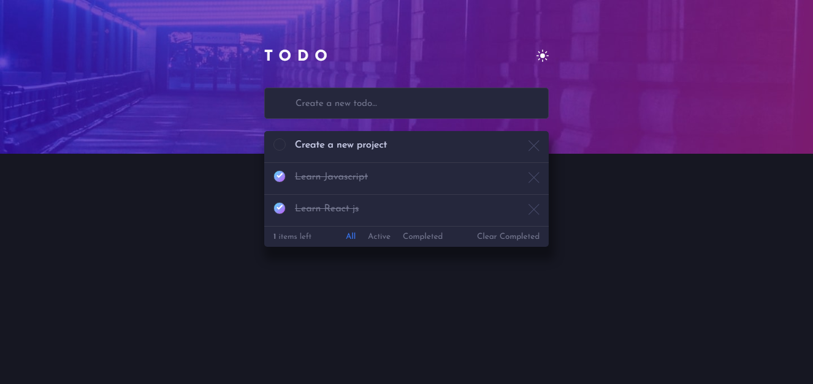

<h1 align="center">ToDo App</h1>

> A React web app

### ✨ [Demo](https://crisav.github.io/ToDoApp/)

<h2 align="center">Desktop version</h2>



 Todo App created with React JS, to organize your tasks, you can use the filter to see the tasks, the finish tasks and your unfinished tasks, delete and add new tasks, the entire app has dark mode.

## Install

```sh
git clone git@github.com:crisav/ToDoApp.git
cd ToDoApp
npm install
npm run build
```

## Usage

```sh
npm start
```

> Runs the app in the development mode.\
> Open [http://localhost:3000](http://localhost:3000) to view it in the browser.

## 📝 License

Copyright © 2021 [Cristian Vega](https://github.com/crisav).<br />
This project is MIT licensed.

***